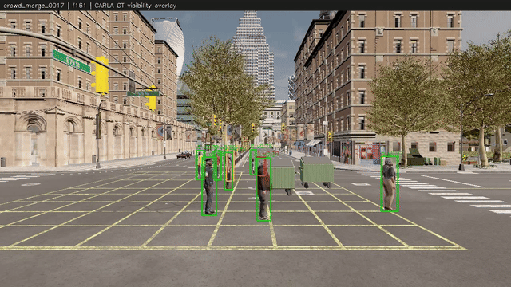
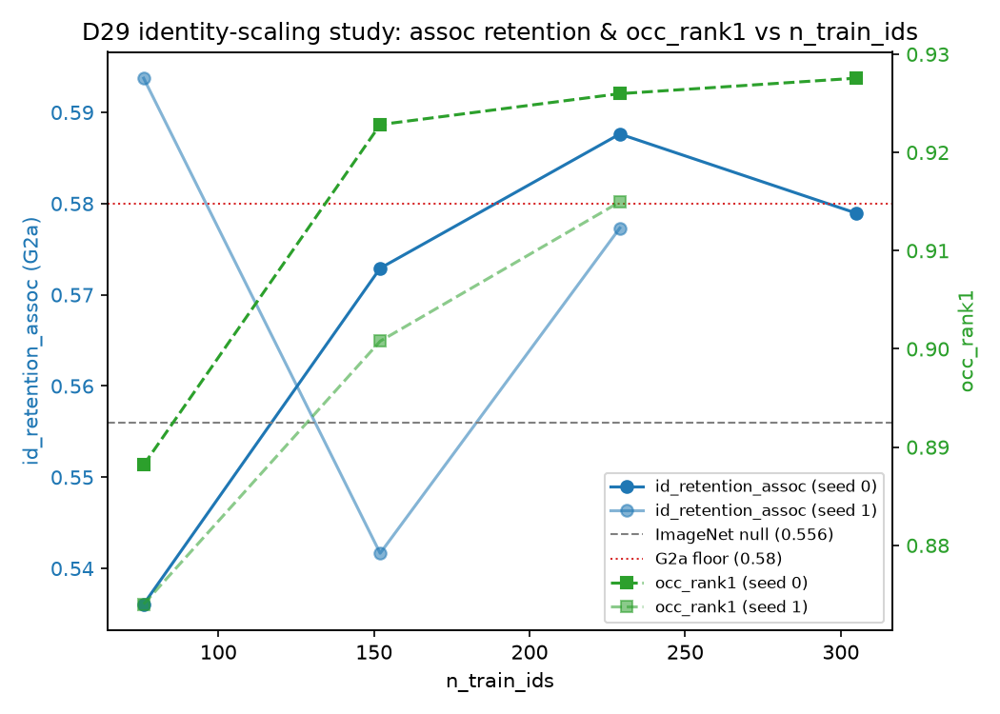
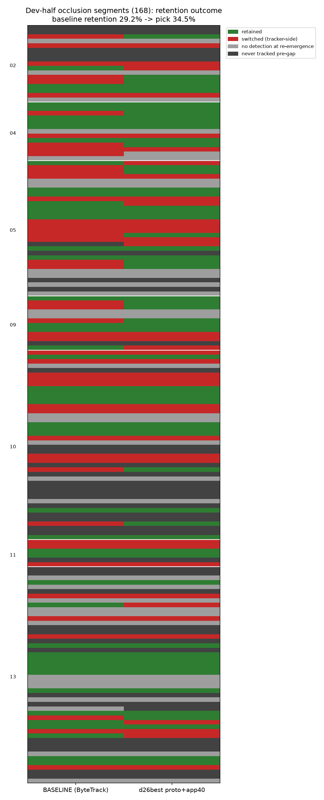
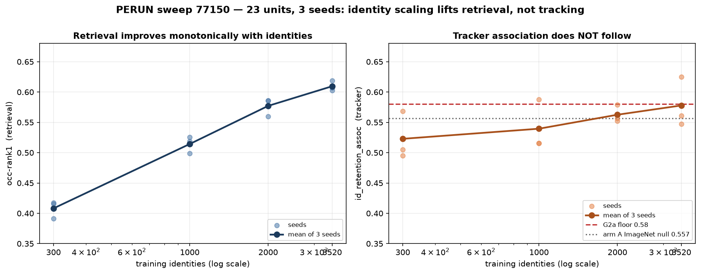

# occlusion-mot

Occlusion-aware multi-object tracking with **hidden-agent state prediction** (P1) and a
**CARLA occlusion-scenario data engine** for sim2real ablation (P2).

**Status: pre-registered val executed as frozen (D45) — G1 parity PASS on val;
G2a margin deferred to the PERUN-scale embedder; sweep submission-ready, awaiting HPC
access.** Dev-half tables below are tuning-time numbers; the val section is the honest
held-out read. Misses are reported, not tuned away.



*CARLA scenario with exact per-walker visibility ground truth (green ≥0.5, orange, red
<0.25) — the P2 data engine that labels occlusion for free. Full clip:
`demo/s5_carla.mp4`.*

## Problem

Trackers lose people behind people. On MOT17, ByteTrack retains the identity through
only **29% of ground-truth occlusion gaps** (dev-half, 168 segments) — 3 of 4 tracked
pedestrians come out of an occlusion as somebody else. This project (a) matches
ByteTrack on the standard metrics (HOTA/IDF1 parity gates), and (b) adds a
hidden-agent module: position estimate while occluded, re-emergence point/time, and
appearance-gated re-identification on reappearance, evaluated on occlusion segments
extracted from GT visibility.

## Architecture

- **Own ByteTrack** (`src/omot/track/`) — Kalman + two-stage IoU association,
  implementation-equivalence proven against a pinned reference (gate G0: ΔHOTA 0.52,
  ΔIDF1 0.07 at identical hyperparameters on identical detections).
- **Frozen-detections protocol** — the detector runs once; every tracker comparison
  consumes the identical cached detections. No comparison in this repo ever mixes
  detector outputs.
- **Hidden-state module** (`src/omot/hidden/`) — occlusion classification at track
  loss, extended coasting buffer with velocity damping (occluded pedestrians barely
  move: median gap displacement 0.02 image diagonals), a recovery association stage,
  and a cosine-distance appearance veto from a trained re-ID embedder
  (ResNet18/BN-neck, occlusion-upweighted triplet + CE, random-erasing = synthetic
  occlusion).
- **Occlusion taxonomy** — every eval emits a failure decomposition: pre-match rate,
  oracle association ceiling, association-scope vs end-to-end retention. This split
  is what separates *module* failures from *detector* failures (G2a vs G2b below).

## Methodology (the part that survives review)

| discipline | implementation |
|---|---|
| Gates G0–G4 | G0 repro **frozen PASS** · G1 parity **PASS on val** · G2 hidden-state: center-err + coverage **PASS on val**, G2a-floor **MISSED on val** (accepted, not re-tuned — D46), G2a-paired pending scale, G2b contingent on detector arm · G3 quality (pytest+ruff+coverage, live) **PASS** · G4 CARLA feeder **PASS** |
| Val freeze | single pre-registered val event (`val_manifest.md`): configs, checkpoint SHA256s, pass/fail mapping, expected-power notes frozen BEFORE the run; executed 2026-08-09 exactly as frozen (D45); no retune after — misses reported, not tuned away |
| Multi-seed discipline | measured seed noise bounds (single-seed tracker deltas <6pt are noise — logged D36); arm comparisons use ≥3-seed means; the discriminating G2a criterion is a paired McNemar test, not a point delta |
| License guards | CI-enforced: zero dataset-derived pixels tracked (per-file visual allowlist with content classes), dataset/cache extensions blocked, 2MB default-deny, train/eval identity-disjointness verified per source |

## Results (dev-half; no single-seed claims — deltas within the ±6pt seed band are not claimed)

| configuration | e2e id retention | assoc-scope retention |
|---|---|---|
| ByteTrack baseline | 0.292 | 0.505 |
| + geometric hidden-state | 0.310 | 0.531 |
| + appearance veto (ImageNet null) | 0.327 | 0.556 |
| + trained embedder | **0.345** | **0.604** |

The baseline→full-stack progression (+5.3pt e2e, +9.9pt assoc) exceeds the seed-noise
band; individual embedder-variant differences do not, and are therefore not claimed —
trained-vs-ImageNet is p=0.26 (paired McNemar, n=96) — resolved at PERUN scale and
still not significant (best p=0.143 over 3 seeds); see the sweep section below.
Re-emergence position error: 0.0055–0.0064 of the image diagonal (gate ≤0.015).

**Detector arm** *(dev-optimistic: detector finetuned ON dev-half GT and scored on
dev-half — the honest read is the pre-registered val run)*: oracle ceiling 0.583→0.845,
full-stack e2e 0.494.

## Val results (pre-registered, executed as frozen — D45, 2026-08-09)

The single val event ran `val_manifest.md` exactly: frozen configs, pinned checkpoint
SHA256s, identical cached detections, no re-runs. **Misses are reported, not tuned
away** — that discipline is the result this section exists to demonstrate.

| verdict | criterion | val | bound |
|---|---|---|---|
| **PASS** | G1 HOTA / IDF1 | 51.07 / 60.09 | ≥ baseline − 0.5 (49.98 / 58.28) |
| **PASS** | G1 ID switches | 298 | ≤ 359 (baseline) |
| **PASS** | re-emergence center err | 0.0090 | ≤ 0.015 |
| **PASS** | conditional coverage | 0.907 | ≥ 0.90 |
| **MISS** | G2a-floor assoc retention | 0.440 | ≥ 0.58 (dev: 0.604) |
| pending | G2a-paired McNemar | p = 0.41 (n = 83) | < 0.05 |

The G2a-floor miss is the finding: a **dev→val generalization gap** — assoc retention
0.604 → 0.440, and the trained-vs-ImageNet margin shrinks from +4.7pt to +2.6pt. The
paired test's non-significance was pre-registered as the expected outcome at this
sample size (underpowered pre-PERUN); both G2a criteria defer to the PERUN-scale
embedder (D46). The occlusion tracker still clears every ByteTrack-parity gate on val
while retaining more identities than the baseline (e2e 0.278 vs 0.263, assoc 0.440
vs 0.412).

**Detector arm on val** *(mandatory label: detector-arm prototype — yolo11s finetuned
10 epochs on DEV-HALF GT only; never saw val frames; val eval clean by construction;
local prototype of the D26 G2b detector workstream, not the headline claim)*: e2e
direction replicated (0.278 → 0.338, assoc 0.577), but the dev oracle-ceiling lift
did **not** transfer (0.632 → 0.586) — confirming the dev-optimism caveat above.

Full report: `results/val/val_report.md`.



*Identity count scales re-ID retrieval monotonically for both seeds; tracker-level
effects don't resolve at local scale — why the PERUN sweep uses log-scale pools and
≥3 seeds.*



## Data engine (P2)

| source | train ids | occluded-query eval ids | crops |
|---|---|---|---|
| MOT17 dev-half tracklets | 269 | 66 | 46.9k |
| CARLA renders (24 scenarios, exact visibility GT) | 36 | 9 | 58.2k |
| MOT20 tracklets (manifest-pinned 80/20 split) | 1,715 | 431 | 378.1k |
| Market-1501 (no vis GT → never in eval) | 1,500 | 0 | 26.0k |
| **total** | **3,520** | **506** | **509k** |

All sources license-verified with pinned provenance; nothing dataset-derived is in
the repo. A wild-clip qualitative showcase (10 permissive-stock clips, annotated) is
available locally / on request — regenerate with `scripts/showcase.py --src
showcase/sources --out showcase/renders`.

## PERUN sweep — executed. The null is the finding.

4-arm ablation (ImageNet-null / sim-only / real-only / sim+real), log-scale identity
pools {300, 1k, 2k, 3.5k} x 3 seeds, plus detector finetunes. Fully pre-registered in
[perun_sweep_v2.md](perun_sweep_v2.md) *before* any run — selection rules, gate
semantics and decision criteria all fixed in advance. Executed 2026-08-19 on TUKE PERUN
(H200): **23/23 units, zero failures, 7.74 H200-h** against a 40 h ceiling.

**Both G2a criteria fail, and that is the reported result.**

| verdict | criterion | sweep | bound |
|---|---|---|---|
| **FAIL** | G2a-floor assoc retention | 0.5779 | >= 0.58 |
| **FAIL** | G2a-paired McNemar (the module claim) | best p = 0.143 | < 0.05 |
| **not established** | P2 claim: sim+real > real-only | see below | pre-registered conjunction |
| — | detector arm (dev-optimistic) | mAP50 0.936 | informs G2b |

McNemar p-values, all seeds, no cherry-picking — D vs A: 0.143 / 0.661 / 0.500;
D vs C: 0.145 / 0.613 / 0.773; C vs A: 0.339 / 0.668 / 0.332 (n ~ 95).



**The mechanism, which is why this is a finding and not just a miss.** Identity count
scales *retrieval* cleanly and monotonically — occ-rank1 0.408 -> 0.514 -> 0.577 ->
0.610 across a 12x identity range, still climbing at the pool ceiling. Tracker
*association* does not follow: 0.523 -> 0.540 -> 0.563 -> 0.578, an 0.055 total effect
against a per-pool seed spread reaching **0.078**. The seed noise is larger than the
entire effect. More identities buy a better embedder and not a better tracker, because
association is not what the embedder is failing at — the detector ceiling is.

That claim is not new here; it was predicted at local scale (D29, D36) and this sweep
is the properly-powered test of it. It survived.

**Caveat that constrains what may be read off this sweep — stated prominently because
it limits our own headline metric.** occ-rank1 is computed on a **per-arm gallery**
(`eval_sources = arm_sources(cfg, arm)`), so **cross-arm occ-rank1 comparisons are
invalid**. The sim-only arm trains on 36 identities and posts the sweep's *highest*
retrieval (0.875) together with its *lowest* association (0.549 — below the ImageNet
null). That is small-gallery inflation, not a result. Consequences, applied honestly:

- The within-arm identity curve above **is** valid (fixed sources, only pool varies).
- The pre-registered P2 verdict required `mean assoc(D) > mean assoc(C)` **and**
  `mean occ-rank1(D) > (C)`. The first holds (0.5779 > 0.5674); the second does not
  (0.6095 < 0.6180) and is cross-arm-invalid anyway. Per the rule as written, **"sim+real
  beats real-only" is not established.**
- G2a-paired is untouched by this: it is tracker-level on a fixed intersection
  denominator shared by both configs under test.

Recorded as [perun_sweep_v2.md](perun_sweep_v2.md) amendment 8, which annotates the
original "primary at sweep scale" line in place rather than rewriting it.

**Budget estimates were 4.3x conservative** (7.74 h actual vs 32.25-34.25 h projected;
`UNIT_EST_H` was RTX 4060-derived). The pre-registered numbers are *not* edited after
the fact — they bounded the run correctly. The measured basis is carried into the next
pre-registration as a documented recalibration (amendment 9).

**Where this leaves the project.** Appearance re-ID at PERUN scale does not deliver
G2a; that line is closed and reported as a negative result. The remaining headroom is
the detector/oracle-ceiling workstream (G2b), pre-registered separately in
[perun_detector_v1.md](perun_detector_v1.md).

## Quickstart

```powershell
uv venv --python 3.11 .venv
uv pip install --python .venv/Scripts/python.exe -r requirements.txt -e .
.venv/Scripts/python.exe -m pytest -q          # full suite incl. license/disjointness guards
.venv/Scripts/python.exe scripts/demo_synthetic.py --render demo.mp4   # dataset-free demo
.venv/Scripts/python.exe scripts/render_demo.py --all                  # regen demo clips (needs MOT17)
```

**Guided tour:** [demo/README.md](demo/README.md) — 10 minutes, S0–S8, from the
failure mode to the gate scoreboard.

## Repo map

- `src/omot/` — loaders, MOT IO, detection/embedding caches, tracker, hidden-state module, eval (incl. paired test)
- `mission.md` / `gates.yaml` / `status.txt` / `context.md` — mission, executable gates, state, full decision log D1–D46
- `val_manifest.md` / `perun_sweep_v2.md` / `perun_detector_v1.md` — frozen val pre-registration; executed sweep design + post-execution amendments; G2b detector pre-registration (draft)
- `configs/sweep/` + `scripts/sweep_*.py` — config-driven sweep (identical entrypoint local/SLURM)
- `demo/` — guided tour + committed CARLA media; `scripts/showcase.py` — wild-clip renderer
- `runloop.ps1` — autonomous development loop (invokes `claude -p` per iteration against the gates)

License: AGPL-3.0-only (see context.md D9 — ultralytics dependency).
