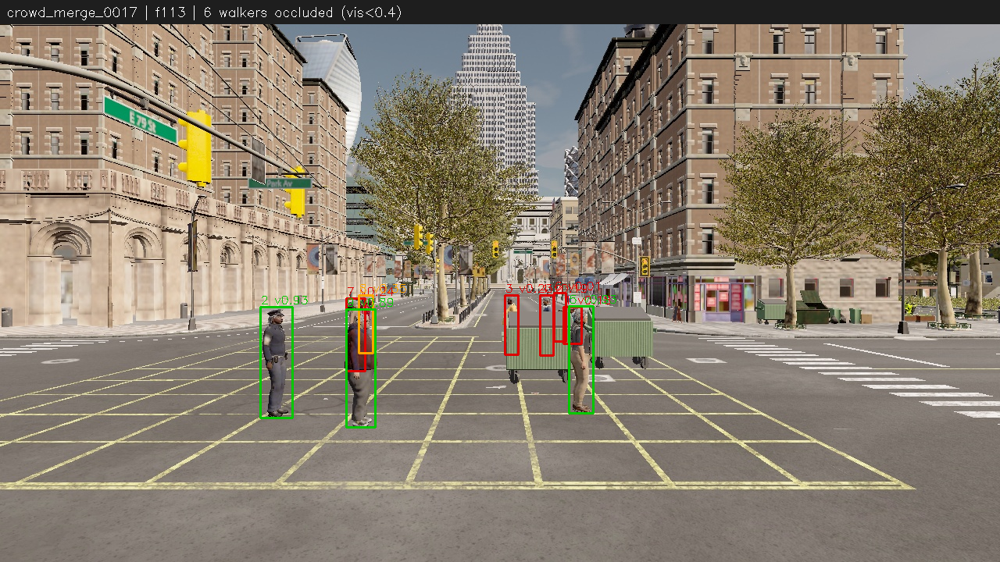
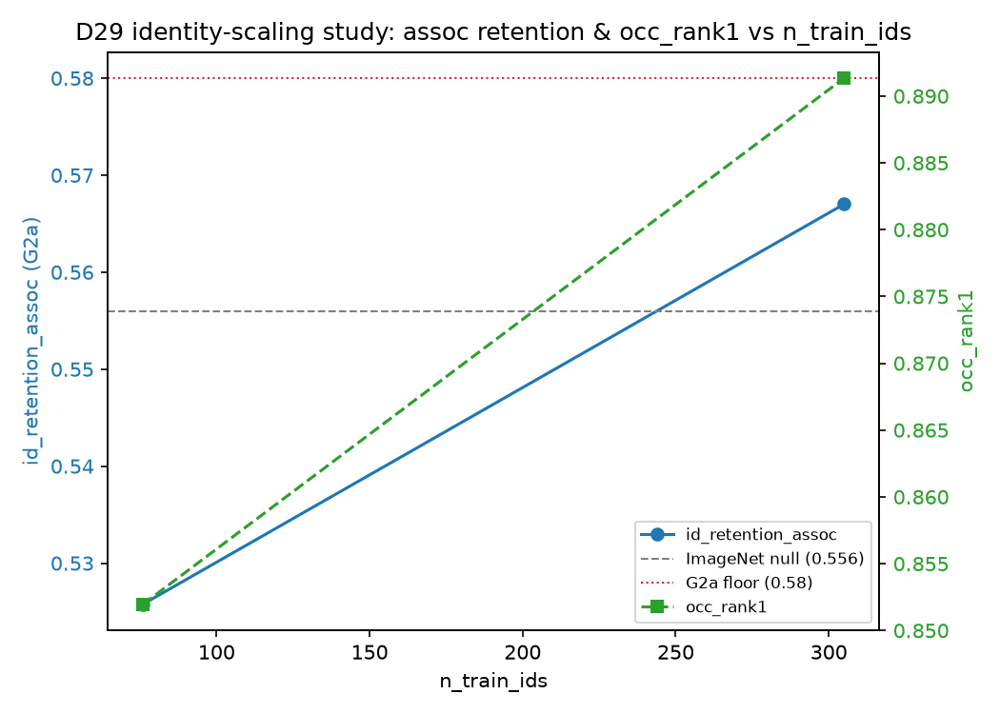

# occlusion-mot demo package (D39)

Guided tour S0-S8: the failure mode -> geometric hidden-state -> appearance re-ID
(ImageNet null vs trained embedder) -> detector upgrade -> CARLA sim2real feeder ->
identity-scaling study -> gate scoreboard. Regenerate everything:
`.venv/Scripts/python.exe scripts/render_demo.py --all`

## S0 -- teaser

One frame from the CARLA driving simulator (scenario `crowd_merge_0017`) with heavy
inter-walker occlusion, GT visibility burned in (green >=0.5, orange 0.25-0.5,
red <0.25).
Open: `start demo/s0_teaser.png`
Caveat: synthetic scene, sets up the problem -- not a tracker result.

## S1 vs S2 -- geometric hidden-state fixes coasting failures
`clips/s1_vs_s2.mp4` -- side by side on segment `MOT17-05-FRCNN:t33:f320-333`: S1 baseline
(left) loses the identity through occlusion, S2 geometric hidden-state (right) coasts
through it and retains.
Dev-half (n=168): retention 0.292 -> 0.310;
assoc-scope retention 0.505 -> 0.531.
Open: `start demo/clips/s1_vs_s2.mp4`
Caveat: geometric mechanisms ceiling out at +1.8pt retention (context.md D19) -- motivates S3/S4.

## S2 solo -- coasting box while hidden
`clips/s2_solo.mp4` -- single panel, same segment as S1vS2, geometric tracker only;
orange box = the coasting hidden-state position estimate while occluded.
Open: `start demo/clips/s2_solo.mp4`
Caveat: constant-velocity-damped estimate, not a learned motion predictor (v1 design, D19).

## S3 vs S4 -- trained embedder beats the ImageNet null
`clips/s3_vs_s4.mp4` -- segment `MOT17-09-FRCNN:t10:f174-207`: S3 ImageNet appearance veto
(left) still switches identity, S4 trained embedder (right) retains it.
Dev-half: ImageNet retention 0.327
(assoc 0.556) -> trained-embedder retention
0.345 (assoc 0.604).
Paired on the intersection set (n=96): 0.604 vs
0.562, discordant 13/9,
McNemar p=0.26.
Open: `start demo/clips/s3_vs_s4.mp4`
Caveat: p=0.26 is NOT significant at dev scale (n~96) --
qualitative win only; the frozen G2a-paired claim needs PERUN-scale identities (D29).

## S4 -- re-ID crop grid (pre/post gap appearance)

Pre-gap | post-gap GT crops for every assoc-scope dev segment under S4, bordered green
(retained) / red (switched) -- where trained appearance still fails (blur, crowd handoff).
Untracked (D37 license hygiene: dataset-derived crop grid). Regenerate:
`.venv/Scripts/python.exe scripts/render_dev_viz.py --base-tag hidden_audit_base --pick-tag hidden_conv_app45 --pick-label "conv app0.45" --pngs-only`
Caveat: MOT17 GT crops -- never committed to the repo per D37.

## S5 -- CARLA sim2real feeder
`s5_carla.mp4` -- one CARLA scenario (`crowd_merge_0017`, ~20s) with per-walker GT
visibility overlaid; committed (synthetic render, not dataset-derived -- D37).
`s5_blueprint_grid.png` -- one crop per walker blueprint identity (45 total, 5x9 grid)
from the sim re-ID pool, appearance-correct labels after the D24 audit fix.
Open: `start demo/s5_carla.mp4` and `start demo/s5_blueprint_grid.png`
Caveat: 45 blueprints is CARLA's exhausted appearance ceiling (D34) -- no further sim
identity diversity without UE4-editor asset work.

## S6 -- detector finetune (honest optimistic read)
`clips/s6_detector.mp4` -- cached detections only (no tracker), stock yolo11x (left) vs
yolo11s finetuned on MOT17 dev-half GT (right), crowded MOT17-02 dev-half window.
Dev-half effect (geometric config): pre-match 0.940, oracle
ceiling 0.845, e2e retention 0.458
(full stack + trained embedder: 0.494).
Open: `start demo/clips/s6_detector.mp4`
Caveat (burned into the right panel too): the detector TRAINED on these dev-half frames
-- train-on-train, optimistic; the clean read is the val-half run (D31, D35).

## S7 -- identity-scaling study

Identity count scales re-ID retrieval quality monotonically (occ-rank1
0.874 -> 0.928 over 76 -> 305 identities, both
seeds); tracker-level assoc retention does NOT resolve at dev scale (seed spread up to
5.8pt swamps the identity effect at n~97 segments) -- D36.
Caveat: this is why the PERUN sweep needs log-scale identity pools and >=3 seeds per
point, not more local epochs (D33).

## S8 -- gate scoreboard + next steps
All G2 rows below: dev half, best config (conv embedder, app gate 0.45).

| gate | status |
|---|---|
| G0 repro | frozen PASS |
| G1 parity | pending |
| G2 center-err | 0.0064 PASS (<=0.015) |
| G2 cov_prematched | 0.914 PASS (>=0.90) |
| G2a-floor (assoc) | 0.598-0.604 vs >=0.58 PASS |
| G2a-paired (McNemar) | p=0.26 n.s. -- pre-PERUN, expected (D29) |
| G2b (end-to-end) | 0.345 -- pending detector-upgrade arm at scale |
| G3 quality | PASS |
| G4 CARLA feeder | PASS |

Next: PERUN 4-arm ablation (arms A/B/C/D, log-scale identity pools, >=3 seeds -- D33/D37
sweep design), D18 canonical val run per `val_manifest.md` (blocked on user approval).

Regenerate all clips/images: `.venv/Scripts/python.exe scripts/render_demo.py --all`
